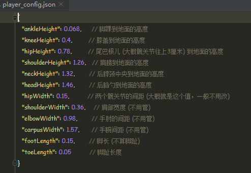
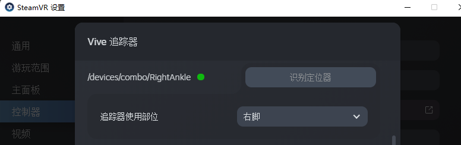

# Combo Link

***Combo Link*** 是一套基于多个tracker的动作捕捉系统。它在全无线方案 `Mark I` 的基础上改进而来：   
* 增加了高精度磁力计，漂移更小
* 各tracker以有线方式串联到主tracker，时间同步在毫秒级别
* 数据传输更稳定
* 续航更持久，可轻松达到50小时及以上
* 配置更简单，使用更方便


## 1. 安装 ComboVR Studio
* 目前只支持 win10 及以上系统，下载地址: [点这里](https://pan.baidu.com/s/1tPnWpzpy8PyTVrCdwJia6w?pwd=vyqe), 提取码: vyqe
* 解压之后, 无需安装, 直接打开 `ComboVR Studio` 文件夹下的 `WonderVrStudio.exe` 即可运行。  
  打开后, 应看到如下界面.   


## 2. 设置身体参数
***可以先跳过这一步，等走完整个流程之后再回来调整参数***   
关闭Studio, 在 `ComboVR Stduio` 文件夹下的player_config.json中设置身体参数(修改相应的数字即可，不要往里边打其他字):




## 3. 为 主Tracker 设置 wifi
如果您使用的是不带dongle的版本，则需要为主tracker配置wifi。步骤如下:   

1. 打开`ComboVR Studio`文件夹下的`MagCalApp.exe`   
2. 用usb线将主tracker(腰部tracker)连接到电脑，从右上角的`Serial Port`下拉框选择端口号   


3. 将wifi名称，密码和电脑ip(可通过在电脑终端输入ipconfig命令查看)写入右下角对应输入框中, 点击`send`按钮发送，此时终端会打出类似如下信息，显示tracker已收到wifi信息

```
Received wifi settings:
wifi name: xiaofeiyang
wifi password: fakePassword
server ip: 192.168.31.147
```

4. 检查无误后，点击`save`按钮，查看终端打印的信息，看到类似如下信息后即代表设置成功。

```
Writing wifi settings into EEPROM...
Write credentials:
ssid: fakePassword
pwd: fy920507
udp address: 192.168.31.147
Wifi setttings saved!
```

5. 设置成功后，点击 `Skip` 按钮，应改会看到tracker开始闪绿灯，在studio界面中也应看到腰部tracker (Waist) 已经状态从`lost`变成`active`, 代表已收到tracker的数据。


## 4. 佩戴 Tracker
* 出货时已为各tracker贴好标签，以方便区分每个tracker对应的位置。   
* 绑带穿过tracker的方式可以有多种，推荐如下图所示这种, 这样绑和取的时候都会方便一些。


各tracker对应的绑定位置如下图所示 (位置不用很严格，小腿的tracker也可以绑在膝盖往下那一截，更不容易滑落；朝向无要求。主要是要绑紧，尽量使得运动时tracker和骨骼间不要有相对滑动。但也不用太紧，不然戴久了难受)：


* 佩戴好Tracker后，用网线将腰部tracker和大腿tracker连起来，大腿tracker和小腿tracker连起来，如果还有胸部tracker，则用附带的四色小线将腰部tracker和胸部tracker连起来。

* 将充电宝揣在兜里，通过typec线给腰部tracker供电。插上电后，等几秒钟，tracker会开始闪绿灯，表明已连上wifi并向电脑发送数据。

## 5. 标定
这一步是为了标定出tracker和人体骨骼之间的相对位置关系，这样我们才能通过tracker的姿态来求解人体骨骼的姿态。请通过如下方法操作：   

* 佩戴好tracker之后，打开steamvr并串流，佩戴好头盔，在VR界面里显示电脑桌面，并显示Studio界面 ( ***这一步第一次使用时可以先忽略，先不用steamvr，先熟悉一下tracker的使用*** )

* 按 T-Pose 站立：笔直站立，双脚分开约15cm，脚尖朝前；头水平直视前方；手不用管。站立好后，点击Studio界面上的Set T-Pose按钮.

  

* 按 S-Pose 站立: 按 T-Pose 的姿势，脚保持不动，膝盖朝前使双腿弯曲，成半蹲姿势；同时上半身往前倾大概20度以上, 手和头不用管。然后点击界面上的 Set S-Pose 按钮.

  

* 然后点击出现的 `Calibrate` 按钮，即标定完成。此时做一些动作，应可看到 Studio 画面中的骨骼随之移动。如发现画面中的人物姿态不是很准，比如脚出现以前一后，可尝试重复2、3、4步骤重新标定，如果多次标定还是不准，应该检查一下tracker是不是佩戴紧了，是不是有滑动。

* 最后，多测一测，看看是否有卡顿和延迟的情况出现。一般来说，至少20分钟内的漂移是比较小的。


## 6. 调试效果
建议先不要着急接入steamvr，应该先多测一测，确保在studio里边能有比较稳定的效果。  
默认是打开了磁力计的，如果你房间的磁场比较干净，应该会有不错的效果。如果你发现studio里边的动作失真比较严重，且每次重新设置T-Pose后不一会儿就又飘了，则有可能是房间的磁场干扰比较大。建议关掉磁力计。

***可通过将 player_config.json 文件中的 `use_magnetometer` 选项由 `true` 改为 `false` 来关闭磁力计***


***关闭磁力计后，为了尽量减小漂移，建议每次使用时，在佩戴在身上前，先连好网线并插上充电宝，将所有tracker都放在地上或桌面上，让studio里边的motion那一栏都变成static，保持一分钟左右，这样会估计出一个非常好的零偏；再将各个tracker佩戴到身上，注意不要断电***


---
这时可以看到Studio界面中的骨骼虽然有动作，但是中心位置是不动的，这是因为没有接入VR头盔的位置数据。  
接下来，就是接入SteamVR的头盔数据，并将虚拟tracker的数据发送给SteamVR.

## 6. 接入VR头盔
* 保持Studio开启，请将VR头盔开机，打开SteamVR, 并将头盔串流 (有线或无线均可)。   
串流成功之后，应可看到Studio界面右上角`HMD`一栏的状态由`lost`变为`active`, 动一动头盔，应可看到界面上画的头盔也会跟着移动。   

***这一步可以不用带上头盔操作，但 Oculus Quest2 会在取下头盔之后自动休眠， 导致收不到新的位置数据，可以将头盔上的红外接近传感器用胶布挡住(如下图所示)，这样它就不知道我们已经取下了头盔，从而不会很快进入休眠模式***


* 然后戴上头盔，重复上面第五步标定流程，这时候再走动走动，就会看到`Studio`界面中的人物位置也开始动了。


## 7. 在SteamVR中使用
到上一步为止，动作跟踪功能已经实现了。但为了在SteamVR和它支持的游戏中(如VRChat)使用，还需安装steamvr的驱动，也很简单:   

* 先关闭SteamVR, 将之前`ComboVR-software`解压出来的`combo_openvr_driver/`下面的 `combo` 文件夹复制到 `SteamVR`的driver文件下下面 (driver的路径一般在: `C:\Program Files (x86)\Steam\steamapps\common\SteamVR\drivers\`). 


* 打开steamvr, 应可看到多出来了3个tracker。

    

* 点击 `SteamVR`图标 --- `设备` --- `管理追踪器` --- `管理Vive追踪器`，为每个 combo trakcer 设置相应的部位即可, 如下面三图所示。
    
    
    

* 设置好后, 带上VR头盔，在 steamvr home 低头看一看，应该可以看到腰部和小腿上的tracker, 动一动看是否正常。然后就可以在 vrchat 等游戏中玩耍了.

---

## *注意事项*

* 重新对齐。目前一般二三十分钟后，tracker的角度漂移会累积得比较大，需要重新对齐：   
  按T-Pose站立，然后长按左手控制器上食指和中指处的扳机(扣到底)，坚持5s，即可看到已重新对齐。