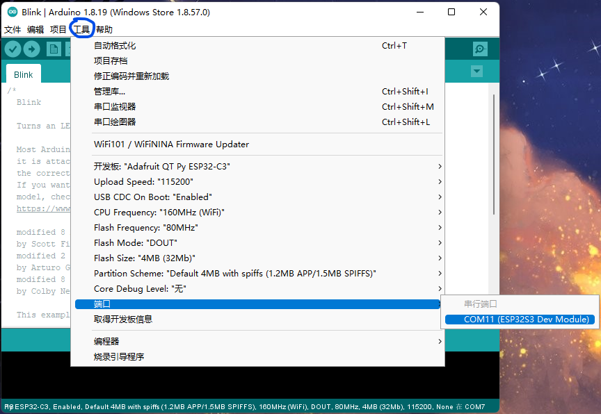
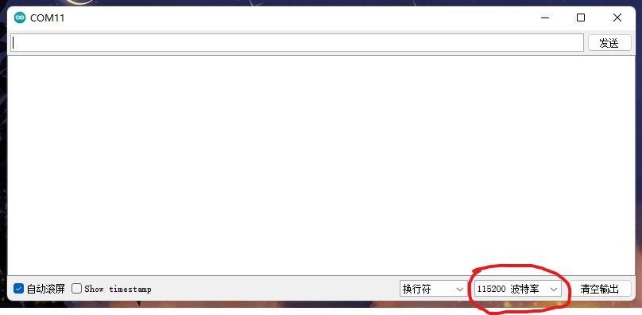
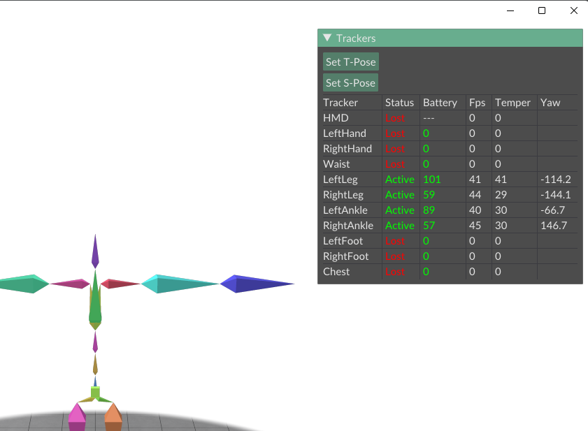
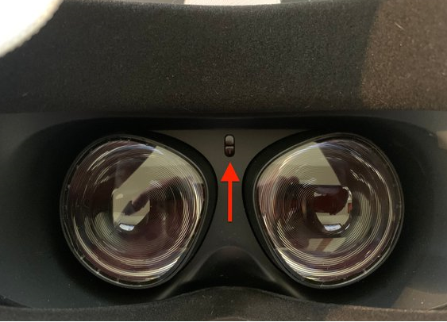
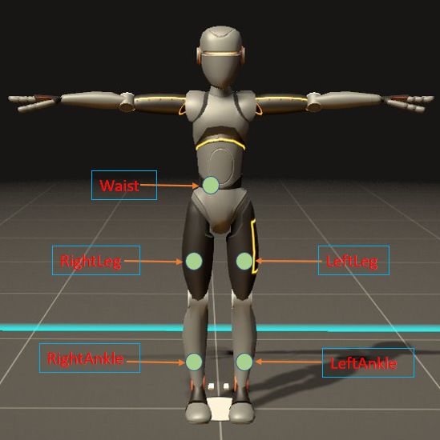
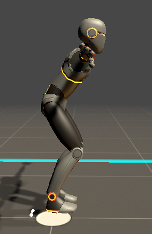

# Mark I

***Mark I*** 是一套基于多个tracker的动作捕捉系统。第一次使用会相对麻烦，需要大概半小时左右，熟悉之后后续的使用很方便，每次设置基本一分钟左右。


## 1. 安装 ComboVR Studio
* 目前只支持 win10 及以上系统，下载地址: [点这里](https://github.com/combovr/ComboVR-software/releases)
* 解压之后, 无需安装, 直接打开 `ComboVR Studio` 文件夹下的 `ComboVrStudio.exe` 即可运行。  
  打开后, 应看到如下界面.   


## 2. 设置身体参数
关闭Studio, 在 `ComboVR Stduio` 文件夹下的player_config.json中设置身体参数(修改相应的数字即可，不要往里边打其他字):


## 3. 为 Tracker 设置 wifi
这一步会稍微麻烦一点, 但只需初次使用的时候配置一次即可。 请确保电脑tracker使用的是同一个路由器，并且需要2.4G频段而不是5G频段。

* 安装 [Arduino IDE](https://www.arduino.cc/en/software) 并打开，请安装1.8.19版本。
* 用usb线将一个tracker连接到电脑上，长按机身上的按键3s开机, 开机后应看到蓝灯亮起. 此时点击 Arduino 的 `工具` ---> `端口`，应该会多出现一个 COM口，选择这个COM口. 

* 选择好后，点击 `工具` ---> `串口监视器` 打开 Arduino 的串口工具，将波特率选择为 115200.

* 在输入栏输入你的wifi名称，按回车键发送。

```
type wifi password (max 32 characters): 
```

* 看到串口打印出上面的信息后，输入你的wifi密码，按回车键发送.

```
type computer ip: 
```
* 看到串口打印出上面的信息后，输入你的电脑ip, 按回车键发送.  
(电脑ip可通过在终端用 `ipconfig` 命令查看)

```
Save above settings? type yes to confirm, type no to start over: 
```
* 看到串口打印出上面的信息后，检查你之前输入的wifi名称、密码和ip，确认无误的话输入 yes 按回车键发送 (反之则发送no, tracker会自动重启，按上面次序重新输入), tracker 会保存设置并自动重启。重启后tracker应可连接上wifi，在你的电脑上打开 `ComboVR Studio`, 应可看到tracker已连接上 （Studio界面右上角`status`一栏，`lost`表示丢失连接，`active`表示已连接上) 。



* 按上述操作，依次为每一个tracker配置好wifi。

***注意: 在 Studio 界面右上角的 `Fps` 一栏，显示的是tracker数据的刷新率，正常情况下应该保持在100左右，如果看到刷新率波动较大，应该是wifi信号不太好，可以将电脑、路由器和tracker放在同一个房间内***


## 4. SteamVR 串流
保持Studio开启，请将VR头盔开机，打开SteamVR, 并将头盔串流 (有线或无线均可)。   
串流成功之后，应可看到Studio界面右上角`HMD`一栏的状态由`lost`变为`active`, 动一动头盔，应可看到界面上画的头盔也会跟着移动。   

***这一步可以不用带上头盔操作，但 Oculus Quest2 会在取下头盔之后自动休眠， 导致收不到新的位置数据，可以将头盔上的红外接近传感器用胶布挡住(如下图所示)，这样它就不知道我们已经取下了头盔，从而不会很快进入休眠模式***



## 5. 佩戴 Tracker
将各tracker佩戴至相应位置，建议为各tracker贴上标签，方便后面使用。如果您不清楚某个tracker属于哪个部位，可以按下面的方式确定：

* 将 tracker 开机或者关机，查看 Studio 界面上哪个部位的tracker的连接状态发生了变化

* 或者，在tracker处于active状态时，转动tracker，查看 Studio 界面上哪个部位的tracker在发生转动    

各tracker对应的绑定位置如下图所示 (位置不用很严格，小腿的tracker也可以绑在膝盖往下那一截，更不容易滑落；朝向无要求。主要是要绑紧，尽量使得运动时tracker和骨骼间不要有相对滑动。但也不用太紧，不然戴久了难受)：




## 6. 标定
这一步是为了标定出tracker和人体骨骼之间的相对位置关系，这样我们才能通过tracker的姿态来求解人体骨骼的姿态。请通过如下方法操作：   

* 佩戴好tracker之后，打开steamvr并串流，佩戴好头盔，在VR界面里显示电脑桌面，并显示Studio界面

* 按 T-Pose 站立：笔直站立，双脚分开约15cm，脚尖朝前；头水平直视前方；手不用管。站立好后，点击Studio界面上的Set T-Pose按钮.

  

* 按 S-Pose 站立: 按 T-Pose 的姿势，脚保持不动，膝盖朝前使双腿弯曲，成半蹲姿势；同时上半身往前倾大概20度以上, 手和头不用管。然后点击界面上的 Set S-Pose 按钮.

  

* 然后点击出现的 `Calibrate` 按钮，即标定完成。此时做一些动作，应可看到 Studio 画面中的骨骼随之移动。如发现画面中的人物姿态不是很准，可尝试重复2、3、4步骤重新标定。


## 7. 在SteamVR中使用
到上一步为止，动作跟踪功能已经实现了。但为了在SteamVR和它支持的游戏中(如VRChat)使用，还需安装steamvr的驱动，也很简单:   

* 先关闭SteamVR, 将之前`ComboVR-software`解压出来的`combo_openvr_driver/`下面的 `combo` 文件夹复制到 `SteamVR`的driver文件下下面 (driver的路径一般在: `C:\Program Files (x86)\Steam\steamapps\common\SteamVR\drivers\`). 


* 打开steamvr, 应可看到多出来了3个tracker。

    

* 点击 `SteamVR`图标 --- `设备` --- `管理追踪器` --- `管理Vive追踪器`，为每个 combo trakcer 设置相应的部位即可, 如下面三图所示。
    
    
    

* 设置好后, 带上VR头盔，在 steamvr home 低头看一看，应该可以看到腰部和小腿上的tracker, 动一动看是否正常。然后就可以在 vrchat 等游戏中玩耍了.

---

## *注意事项*

* 通过长按tracker机身上的按键3秒钟进行开关机

* 建议每次使用时，将各tracker依次开机后放在桌面上静置10秒左右，待tracker上的闪烁的指示灯由黄变绿时，再佩戴在身上

* 充电时，tracker机身左下角的led灯指示充电状态: 橘色表示正在充电，绿色表示已充满.

* 重新对齐。目前一般二三十分钟后，tracker的角度漂移会累积得比较大，需要重新对齐：   
  按T-Pose站立，然后长按左手控制器上食指和中指处的扳机(扣到底)，坚持5s，即可看到已重新对齐。